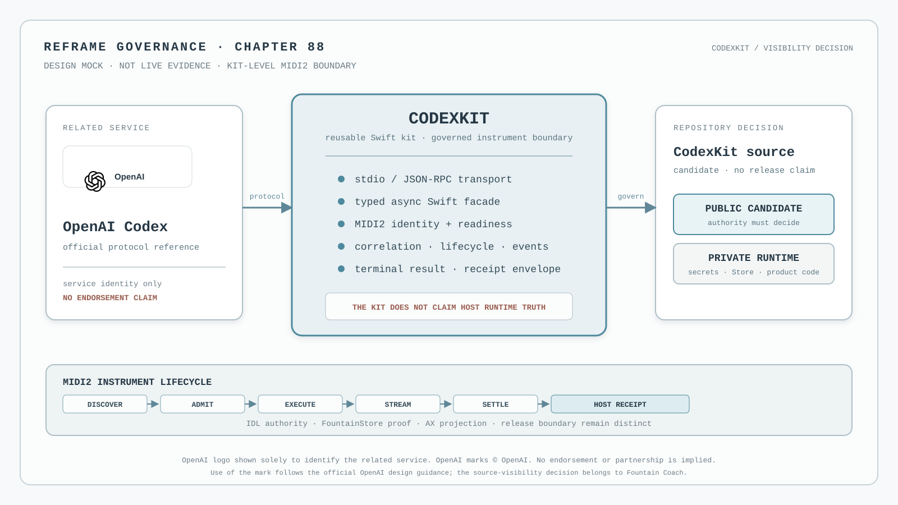

# 88 — CodexKit Is a Governed Codex App-Server Boundary

CodexKit is the proposed reusable Swift kit for embedding a pinned Codex app-server runtime inside a macOS
application. It is not a second OpenAI client, not a Reframe runtime, and not a place to copy private authentication
or product state. Its purpose is to make a difficult boundary explicit: a host application owns a verified Codex
runtime as a child process, speaks its current protocol over a typed transport, and exposes the result through the
host's own governed capability and evidence surfaces.

This chapter is a governance contract and an FCIS-KIT work item. It does not claim that CodexKit exists, that a
runtime is bundled, that authentication works, or that a Reframe scenario has been live-accepted.



*Design mock, not runtime or release evidence. The OpenAI mark is included only to identify the related Codex
service. It is not a claim of endorsement, partnership, product ownership, or public availability. The source-visibility
decision remains a Fountain Coach governance decision and does not expose private runtime code, credentials, Store data,
or product state. Logo use follows the [official OpenAI design guidance](https://openai.com/brand/).*

## The decision

CodexKit may be created as an organisation-owned, reusable Swift package or kit repository. Its generic boundary is:

```text
verified Codex runtime bundle
        → isolated child Process
        → bidirectional JSON-RPC stdio transport
        → typed async Swift façade
        → CodexKit MIDI2 instrument
        → host-owned capability / Store / AX evidence
```

The kit owns process lifecycle, transport correlation, protocol-version compatibility, typed request and event
decoding, cancellation, shutdown, authentication routing, account and thread façades, approval delivery, and safe
diagnostics, and its complete MIDI2 instrument boundary. The consuming application owns product meaning, user intent
mediation, lane election, host Store binding, accessibility projection, scenario acceptance, and release claims.

The kit must never become a private alternative to the MIDI backplane IDL. The kit-level instrument is the reusable
MIDI2 boundary; a Reframe consumer binds that instrument to its existing lane identity and host capability registry.
A process being reachable or a thread being open is not a semantic result. The instrument must publish the actual
operation lifecycle and terminal result, and the host must bind that result to its Store receipt and AX surface.

## Official protocol authority, not SDK substitution

The Codex app-server protocol is an external, revisioned authority. The current official Codex source and app-server
schema must be inspected and pinned before implementation; method names, event names, authentication flows, and
generated types must not be guessed from an older client or from prose in this chapter.

OpenAI describes Codex App Server as a client-facing bidirectional JSON-RPC API in its [official Codex App Server
overview](https://openai.com/index/unlocking-the-codex-harness/). The [official OpenAI Developer documentation
index](https://developers.openai.com/) remains the authority for OpenAI API and SDK products. Those authorities are
related but not interchangeable:

- OpenAI API SDK documentation does not define the Codex app-server protocol.
- The pinned official Codex repository and its generated app-server schema define the runtime protocol used by this
  kit.
- A direct OpenAI API client, if ever introduced, is a separate provider and governance boundary. It must not be
  silently substituted for Codex app-server, and a ChatGPT/Codex session credential must never be treated as an API
  key.

The implementation record must retain the exact upstream repository revision, protocol/schema revision, packaged
runtime digest, and compatibility result. A documentation URL without those identities is not implementation
provenance.

## FCIS-KIT placement

CodexKit enters the FCIS-KIT pipeline as a generic candidate. Before a release, it must have the same separation used
by other reusable kits:

| Boundary | CodexKit may own | CodexKit must not own |
| --- | --- | --- |
| Core | Swift value types, async façade, transport, runtime/process lifecycle, compatibility, typed errors | Reframe views, manuscript types, product verbs, private Store models |
| Runtime adapter | Bundled executable admission, isolated `CODEX_HOME`, stderr capture, shutdown and cancellation | An unpinned download, system `PATH`, npm/Python/Rust/Homebrew discovery, shell orchestration |
| Authentication | The protocol's supported login/account routing and redacted state | Raw tokens, secret persistence, automatic approval, credential invention |
| MIDI2 instrument | The IDL-bound instrument adapter, discovery/readiness, operation correlation, lifecycle, result envelope, and protocol event mirror | Reframe product verbs, host lane election, host Store paths, AX claims, scenario verdicts |
| Consumer integration | A documented host seam and test doubles | Reframe-specific meaning or a second MIDI2 vocabulary |
| Evidence | Correlation, protocol revision, runtime digest, and diagnostic metadata | A claim that a host capability is available, executable, live-accepted, or released |

The kit has no UI and no credentials. Its public API must be usable with a fake app-server or mock transport so that
protocol and concurrency tests do not require a live account. Reframe-specific meaning belongs in the private runtime
repository and in the governed host Store/AX acceptance path, not in the generic kit. The kit's MIDI2 instrument is
generic and reusable; it is not optional plumbing.

## The kit-level MIDI2 instrument

CodexKit is not complete when its Swift façade can call the child process. The kit is a MIDI2 instrument with an
identity, a declared operation surface, a negotiated session, and typed terminal evidence. The MIDI2 backplane IDL
remains the sole contract. The kit may generate or consume its instrument facts from that IDL, but it may not invent a
parallel JSON-RPC-shaped command language and call it MIDI2.

The instrument must expose, through the IDL-governed operation plane, the supported Codex lifecycle at the kit
boundary:

- instrument discovery, protocol compatibility, and readiness admission;
- redacted authentication and account-state inspection;
- thread creation, resume, and lookup;
- turn submission and ordered streaming events;
- explicit approval request and response;
- cancellation and interruption;
- typed failure, refusal, disconnect, and resume state; and
- deterministic shutdown and terminal receipt settlement.

The exact operation identities, payloads, roles, QoS, budgets, and response topics are implementation inputs to the
IDL review. They must be inspected against the pinned upstream app-server schema and then generated into facts and
typed Swift contracts. This chapter deliberately does not guess their final names.

Every instrument operation has one correlation identity, one execution identity, one monotonic lifecycle, and one
terminal predicate. A JSON-RPC request or event is an internal transport detail unless the corresponding MIDI2
operation has admitted it. A successful child-process write is not an admitted operation; an app-server event is not a
terminal result; and a terminal result without a durable host receipt is not a completed host capability.

The kit instrument owns protocol-level receipt data: upstream revision, protocol/schema revision, runtime digest,
instrument/session identity, correlation and execution identity, sequence, phase, redacted account state, and the
terminal result envelope. The host supplies the Store authority and records the product-specific receipt. This keeps
the reusable kit fully instrumentalized without allowing it to claim Reframe behavior or access private product data.

The instrument publishes event-driven state. Store change streams and host subscriptions may replay or reconcile
events, but polling, shell watchers, elapsed-time inference, and GUI callbacks are not instrument behavior.

## Runtime and process boundary

The runtime is a declared application resource at `.app/Contents/Resources/Codex` or an equivalent explicit resource
location. Admission requires all of the following:

1. the executable is present, executable, and bound to the expected platform and architecture;
2. the package is pinned to an upstream revision and verified digest;
3. the app-server protocol/schema revision is compatible with the façade;
4. the child receives an app-specific `CODEX_HOME` and an explicit environment;
5. no system `PATH`, package manager, shell profile, or ambient developer installation is consulted; and
6. signing, hardened-runtime, sandbox, file-access, network, and macOS distribution limitations are recorded as
   platform facts rather than hidden behind a successful local launch.

The kit starts one owned `Process`, retains its PID, reads stdout as protocol input, reads stderr as diagnostics, and
closes both streams deterministically. It must route concurrent requests by protocol request identity, preserve event
ordering and unknown events, distinguish cancellation from failure, and make shutdown idempotent. A dropped pipe,
unexpected exit, malformed envelope, or schema mismatch is a typed terminal condition—not a timeout that a caller
must guess around.

## Authentication, approvals, and safety

Authentication is an explicit protocol capability with redacted state. The host may present login or account actions,
but the kit must not log, expose, infer, or persist raw tokens. It must not turn the presence of a credential into
permission to spend, mutate, or approve. Approvals remain explicit, typed, cancellable, and visible to the host;
security-sensitive actions are never auto-approved by a convenience default.

The kit must expose enough state for the host to distinguish configured, authenticated, account-readable, thread-ready,
and unavailable. It must not report `connected` merely because the child process started. It must not report a turn as
successful because a request was accepted, an event was received, or prose appeared before a terminal result.

## MIDI2 and host evidence integration

When Reframe adopts CodexKit, it consumes the kit's MIDI2 instrument rather than wrapping a black-box Swift client.
The Reframe lane identity participates in the existing discovery and readiness handshake, but readiness is only
admission. Every meaningful action is an IDL-governed MIDI2 operation with generated facts, lifecycle identity, host
Store binding, and a terminal predicate.

The adapter must report at least:

- lane and provider identity, protocol/runtime revision, and correlation identity;
- authentication and account state without secrets;
- request admission, execution, progress, refusal, cancellation, failure, and terminal result;
- thread/turn identity and the source revision or scenario identity that caused the action;
- the durable host FountainStore event or receipt that proves the host-side result; and
- the evidence boundary: executable, live-accepted, or released only when its owning authority proves that state.

The MIDI2 Monitor is the live projection; FountainStore is behavioral proof; AX is the machine-readable UI surface;
window-ID capture, telemetry, provenance, and scenario records remain independent witnesses. No log line, screenshot,
model text, or child-process exit may stand in for the missing authority.

## Compatibility and change management

The façade is generated or checked from the pinned protocol contract wherever the upstream protocol permits it. Unknown
events are preserved as typed opaque envelopes with their correlation metadata. A compatibility check runs before a
session is admitted and records the result. A protocol change requires regenerated artifacts, focused transport tests,
an updated upstream revision/digest, and a new acceptance record; it is not repaired by silently ignoring fields.

The first implementation slice is deliberately narrow: authenticate or inspect account state, create or resume a
thread, send one turn, stream events, answer an approval explicitly, and shut down. Additional Codex capabilities are
separate registry identities and separate evidence, not undocumented methods added to a broad façade.

## Required tests and acceptance

The kit's test suite must cover JSON-RPC encoding and decoding, concurrent request routing, event ordering, unknown
events, malformed messages, stderr separation, cancellation, child termination, idempotent shutdown, authentication
routing, account and thread flows, streaming, approval refusal, protocol compatibility, runtime digest admission, and
secret redaction. Tests use a fake app-server or mock transport and do not require a real credential.

FCIS-KIT acceptance additionally requires:

1. a repository declaration, AGENTS.md, PLANS.md, source contract, README, licence, security boundary, and FCIS audit;
2. a versioned package or named build with reproducible runtime resource checksums;
3. generated or pinned protocol artifacts whose source revision is recorded;
4. a kit-level MIDI2 instrument contract proving that Codex actions enter the existing IDL plane without a second
   vocabulary;
5. Store, AX, provenance, and scenario evidence for the first consuming Reframe capability; and
6. an explicit separation between executable, available, live-accepted, and released.

The SwiftUI example requested by the work item is a teaching projection only. It may show disconnected, sign-in,
connected, prompt, streaming, approval, failure, and terminal states, but it cannot certify the underlying capability.

## Stop conditions

An agent or maintainer must stop rather than infer or substitute when:

- the current official app-server protocol or schema cannot be inspected and pinned;
- the bundled runtime is missing, unverified, unsigned as required, or found through an ambient installation;
- protocol compatibility or capability negotiation fails;
- the required macOS process, sandbox, network, filesystem, or signing environment is unavailable;
- authentication or approval authority is unavailable, ambiguous, or would require exposing a secret;
- the kit-level instrument would need private Reframe types, Store data, UI state, or product assumptions;
- a MIDI2 operation, generated fact, Store receipt, AX state, or terminal predicate is missing;
- a runtime defect would be inferred without checking the owning implementation;
- a live-accepted claim lacks the required independent evidence; or
- a release claim lacks a named, verified build.

The HTML chapter and any Book projection may route to these authorities, but neither may repair a missing authority by
restating an intention.

## FCIS-KIT work item

The pasted CodexKit prompt is recorded as a proposed implementation scope, not as proof of a repository or runtime.
The implementation order is:

1. inspect the current official Codex repository, app-server schema, authentication flow, packaging, and macOS limits;
2. record implementation notes, selected upstream revision, protocol source, and unresolved compatibility questions;
3. establish the generic Swift transport/runtime kit and fake app-server tests;
4. add authentication, account, thread, streaming, approvals, cancellation, and shutdown in bounded slices;
5. make the kit-level MIDI2 instrument admit, execute, stream, settle, and receipt its governed operations;
6. create the Reframe host binding that maps the instrument to product capabilities and durable host evidence;
7. run the focused Swift and contract gates, then the independent Reframe live-drive acceptance; and
8. publish only after FCIS-KIT, security, provenance, AX, Store, scenario, and named-release evidence exists.

No step may promote the prompt, a working child process, or a successful mock into a product capability.

## Governing sentence

CodexKit may make a verified Codex app-server runtime reusable, but only the owning host authorities may say what an
operation means, what it changed, what the writer could see, and whether it is live-accepted or released.
