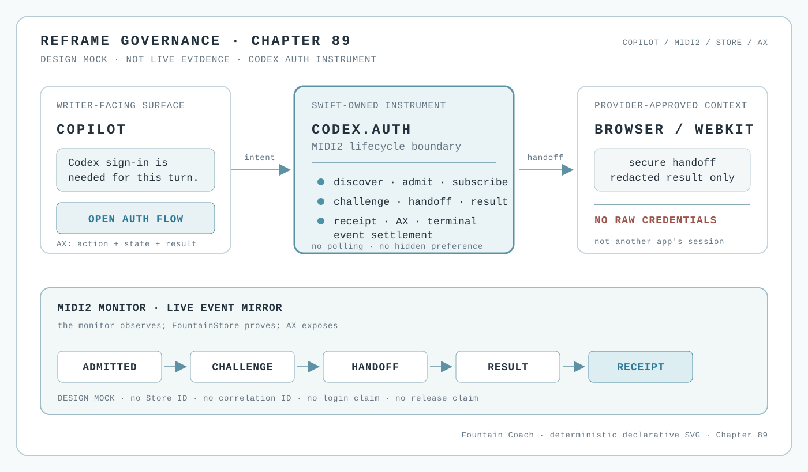

# 89 — The Codex Auth Instrument Is the Copilot Login Surface

The Codex login is not a hidden fact that Reframe discovers from another application on the machine. It is a
host-owned capability with an explicit lifecycle. Reframe asks for the session through its own Codex auth instrument,
projects that lifecycle through the Copilot, and mirrors the same typed events in the MIDI2 Monitor. The writer does not
open Preferences, inspect another app's credential file, or infer authentication from a reachable process.



*Design mock, not runtime or release evidence. The illustration is a deterministic architectural projection: it does
not establish an AX tree, a Store receipt, a MIDI2 session, a successful login, a provider permission, or a live
WebKit implementation. No credential, token, account identifier, or private authentication material is shown.*

## The decision

Reframe replaces its former Preferences-led login path with one governed capability:

```text
Copilot intent
    → Reframe auth instrument
    → MIDI2 discovery / readiness / lifecycle
    → provider-authorized browser or WebKit projection
    → redacted authenticated-state result
    → FountainStore receipt + AX-visible Copilot and Monitor projection
```

The instrument is the authority for the operation lifecycle. The provider's authentication service is the authority
for the credential exchange. FountainStore is the behavioral authority for what Reframe recorded. AX is the
machine-readable UI authority. The Copilot and the MIDI2 Monitor are projections of those authorities; neither may
invent a state because a view loaded or a child process answered.

This chapter is a host-surface contract adjacent to [CodexKit's reusable boundary](88-codexkit-is-a-governed-codex-app-server-boundary.md).
CodexKit may own protocol transport and redacted account routing. Reframe owns product intent, lane policy, the
managed Store, and the writer-facing projection. Neither layer may silently become the other.

## The instrument lifecycle

The implementation binds these logical states to the existing MIDI2 IDL and generated facts; this list is not a new
private vocabulary:

```text
discovered
  → admitted
  → login-required
  → challenge-presented
  → browser-auth-in-progress
  → authenticated | refused | failed | canceled
```

Each admitted operation has one session identity, one correlation identity, one monotonic sequence, and one terminal
predicate. The instrument subscribes before dispatching the login operation. A terminal MIDI2 event closes the live
stream. A Store change event may reconcile a durable receipt after that event; it is not a polling loop, a timeout
watcher, or an alternative command bus.

The instrument must distinguish at least:

- the auth capability being declared and admitted;
- a challenge being available to the writer;
- a browser or WebKit surface being loaded;
- credentials being accepted by the provider;
- the account being readable by the Codex runtime; and
- Reframe having persisted a terminal receipt.

Only the final state has the meaning “authenticated in this Reframe session,” and that sentence must point to its
Store receipt and redacted provider/account evidence. Reachability, a loaded page, a returned challenge, a process
exit, or a visible browser account is not authentication proof.

## Copilot is the writer-facing login surface

The Copilot teaches the writer what is needed when the auth capability becomes relevant, states the current state in
plain language, and shows the effect of a successful session. Examples of truthful wording are:

- “Codex is not authenticated in this Reframe session. I can open its sign-in flow.”
- “The sign-in challenge is ready; complete it in the secure authentication surface.”
- “The provider accepted the sign-in. I am checking the account state before offering Codex work.”
- “The provider sign-in succeeded, but Reframe has not yet received an account receipt. I am not calling this
  authenticated.”

The Copilot may offer a button or link as an accessible action, but the action is a projection of the admitted
instrument operation. It is not a second login executor. The Copilot must not ask the writer to configure a provider,
paste a token, or turn on a hidden preference. Account facts may remain available behind a lean account surface as
per [No Preferences, Only Reasoning](22-no-preferences-only-reasoning.md), but behavioral decisions and auth actions
are conversational capabilities as required by [The CoPilot Is the Surface](25-the-copilot-is-the-surface.md).

## WebKit and system authentication boundary

The WebKit view is a projection instrument, not a credential vault. It may render a provider-approved login or device
challenge page when the provider's supported flow permits that surface. It may show progress, refusal, cancellation,
and terminal account state. It must never expose raw tokens to Reframe UI, persist credentials in web storage, read
another application's authentication files, or treat cookies inherited from an unrelated application as Reframe's
session.

Where the provider requires a system browser or an operating-system authentication session, Reframe uses that
provider-supported handoff and receives only the documented redacted result. A WebKit view must not impersonate a
system login context or weaken the provider's security boundary merely to keep the experience in one window. The
instrument reports the handoff as an explicit phase so the Copilot can say what is actually waiting for the writer.

The login session belongs to Reframe. It is not implicitly borrowed from Codex CLI, the Codex desktop application,
Safari, ChatGPT, another Reframe process, or an ambient machine credential. A provider may authorize a session through
ChatGPT/Codex sign-in or another supported mechanism, but the selected mechanism and workspace permission must be
reported as redacted facts, never guessed from local software being open.

## MIDI2 Monitor and evidence ownership

The [MIDI2 Monitor](87-midi2-monitor-is-the-live-event-mirror.md) shows the auth instrument's live lifecycle first:
admission, challenge, handoff, provider result, account-read result, refusal, cancellation, and terminal settlement.
It preserves correlation and sequence identity and does not rewrite the IDL phases for display convenience.

The ownership chain is:

```text
Codex auth provider
    → CodexKit protocol result
    → Reframe auth instrument event
    → FountainStore receipt
    → MIDI2 Monitor + Copilot AX projection
    → independent scenario evidence
```

The Store receipt settles what Reframe recorded. The monitor establishes what the MIDI2 boundary observed. AX
establishes what the writer could see and operate. A window-ID capture establishes the rendered window. Logs remain
telemetry. These witnesses are complementary and cannot be substituted for one another.

## Retirement of Preferences

The old Preferences path is retired as a behavioral login surface. No writer-facing control may configure a provider,
choose an auth lane, or claim a session by reading a stored toggle. A lean account/status fact surface may remain for
inspection, but it cannot start an untracked operation or become a hidden authority.

Retirement is complete only when the capability is reachable through Copilot, the auth instrument is declared in the
MIDI2 plane, the monitor reports its lifecycle, the Store persists its receipt, and the Copilot exposes the resulting
state through AX. Removing a Preferences button alone would create an unreachable default and is therefore not a valid
migration.

## Acceptance boundary

The first implementation slice is accepted only when all of the following are independently evidenced:

1. the auth instrument is admitted against the MIDI2 IDL and generated facts;
2. subscription is armed before login dispatch and no polling or elapsed-time inference is used;
3. the Copilot can initiate the operation and exposes every state and action through AX;
4. WebKit/system-browser handoff never exposes or stores raw credentials in Reframe;
5. success is projected only after provider acceptance, account readability, and a durable FountainStore receipt;
6. refusal, failure, cancellation, disconnect, and resume are terminally typed and visible;
7. the MIDI2 Monitor displays the same correlation and lifecycle without becoming a second reducer;
8. a fresh Reframe process does not inherit another application's session without an explicit provider-supported
   handoff; and
9. the complete evidence tuple distinguishes available, executable, live-accepted, and released.

The governance chapter, SVG mock, unit tests, or a successful browser page cannot satisfy these gates by themselves.

## Stop conditions

Stop rather than infer or substitute when:

- the provider's supported auth flow or current protocol cannot be inspected and pinned;
- the auth instrument cannot be admitted or its MIDI2 contract is unavailable;
- the browser/WebKit handoff would require raw credentials, ambient cookies, or another application's auth state;
- the terminal provider result is missing or cannot be correlated to the Reframe operation;
- account readability or the managed FountainStore receipt is missing;
- the Copilot or MIDI2 Monitor state is not AX-visible;
- the source runtime, execution environment, workspace permission, or required credential authority is unavailable;
- the operation would be reported from a log, screenshot, loaded page, process exit, or timeout alone; or
- live-acceptance or named-release evidence is absent for the claim being made.

## Governing sentence

Reframe owns the Codex login session as a MIDI2 instrument: Copilot asks, the provider authenticates, WebKit or the
system browser projects only the approved exchange, FountainStore proves what Reframe recorded, and the MIDI2 Monitor
shows the event lifecycle without inventing a state.
