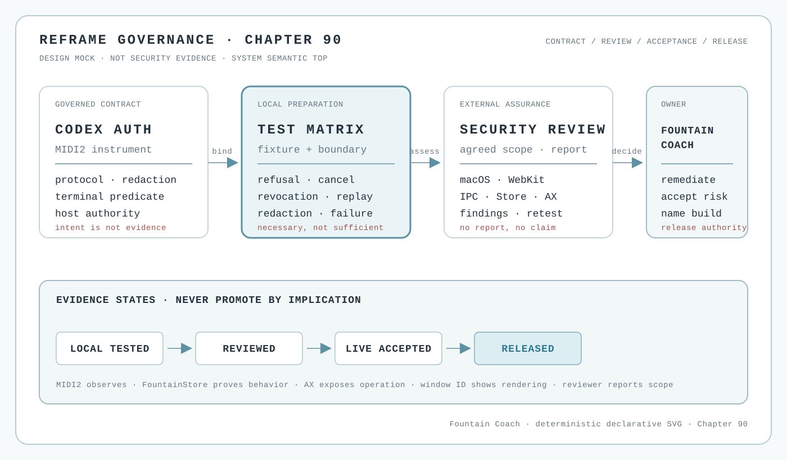

# 90 — Independent Security Review Is a Separate Acceptance Boundary

Reframe can be locally well-tested and still not be security-reviewed. The Codex auth instrument therefore needs an
independent security boundary before Fountain Coach makes a security claim about it. This chapter governs that
boundary. It does not certify the instrument, certify a provider integration, or claim that a reviewer has been hired.



*Design mock, not security evidence. The illustration is a deterministic architectural projection. It contains no
credentials, provider session, Store identifier, runtime result, reviewer finding, or release claim.*

## The decision

Security assurance is a distinct evidence lane in the Codex auth lifecycle:

```text
governed contract
    → fixture and boundary tests
    → provider-authorized scenario evidence
    → independent security review
    → Fountain Coach release decision
```

Each arrow is a gate, not an assumption. A passing unit test does not prove that a packaged macOS app keeps secrets
out of process arguments, WebKit storage, crash material, logs, temporary files, or Store projections. A successful
provider sign-in does not prove that the host isolates sessions, handles revocation, or survives malformed and
adversarial input. A reviewer’s report does not replace the product’s own live-acceptance and named-build authorities.

The authorities remain separate:

- the MIDI2 IDL and generated facts define the instrument contract;
- the implementation repository owns runtime behavior and its boundary tests;
- FountainStore proves what Reframe recorded;
- AX proves what the user and an accessibility-driven agent could operate and see;
- the external security reviewer assesses the agreed security scope and reports findings;
- Fountain Coach owns remediation, risk acceptance, and release authorization.

No witness may silently stand in for another. The system may be secure in one dimension and unproven in another.

## What “tested” means here

The local test suite is necessary preparation, not the independent review. It must exercise the Codex auth instrument
with a fake app-server or mock transport and keep raw credentials absent. At minimum, the maintained matrix covers:

| Scenario | What it establishes | What it does not establish |
| --- | --- | --- |
| provider refusal | typed refusal and redacted terminal projection | provider security or account policy |
| user cancellation | cancellation is distinct from failure and success | safe behavior under every UI interruption |
| logout or revocation | stale authenticated state is not retained as current | provider-side revocation correctness |
| boundary inspection | packaged process, environment, WebKit, Store, AX, logs, crash, and temporary-file surfaces can be inspected | absence of an undiscovered vulnerability |
| runtime or permission failure | failure is terminal, correlated, and visible | macOS platform security assurance |
| replay and ordering | duplicate, delayed, and out-of-order protocol events cannot fabricate success | hostile implementation or supply-chain behavior |

The matrix is evidence preparation. It may move a capability from untested to locally tested; it cannot move it to
security-reviewed, live-accepted, or released by itself.

## The independent review

For the Codex auth instrument, Fountain Coach should commission an independent security-testing provider with a
recognised professional accreditation appropriate to the agreed scope. The provider’s authority comes from its signed
engagement and report, not from a badge copied into the website. The engagement should cover, at minimum:

- macOS packaging, signing, hardened-runtime and sandbox assumptions;
- Keychain, TCC, WebKit, system-browser handoff, cookies, web storage, and session isolation;
- child-process environment, arguments, stdin/stdout/stderr, crash and temporary-file handling;
- local IPC and MIDI2 event boundaries, correlation, replay, ordering, cancellation, and redaction;
- FountainStore receipts and AX projections, including whether sensitive state crosses the public UI boundary;
- malformed protocol input, provider refusal, disconnect, revocation, and recovery; and
- dependency, update, provenance, and named-build controls.

Apple notarization and App Store review are valuable platform distribution gates, but they are not a substitute for
this engagement. They do not give Fountain Coach a source-level security assessment of its implementation, protocol
adapter, local Store boundary, or product-specific authentication flow. Apple’s Security Bounty is likewise a channel
for vulnerabilities in Apple products and services, not a review service for Fountain Coach.

The public chapter may link to the review scope and to a later approved report summary. It must not publish credentials,
private findings, exploit material, provider account data, Store data, prompts, manuscript material, or an assertion
that a review exists before the engagement authority and report are actually available.

## An internal adversarial instrument is not a conformity-assessment body

Fountain Coach may operate its own bounded adversarial-security instrument. It may use creative attack generation,
malformed protocol input, replay, boundary probing, fixture mutation, and other authorized red-team techniques to find
and reproduce weaknesses. Its MIDI2 and FountainStore receipts can make the internal assessment reproducible and
valuable for engineering.

That instrument remains **self-assessment**. It is not an independent penetration service, an accredited laboratory,
a certification body, an EUCC certificate, or an approval authority. Its strongest honest result is:

> internal adversarial assessment executed against the declared scope, with the recorded findings and limitations.

It must not publish “EU-accredited,” “independently penetration-tested,” “secure,” or “release-approved” merely because
the agent found no issue or because its run was MIDI2-instrumented. A self-operated agent may prepare an external
engagement; it cannot supply the independence required for that engagement.

## The European legal and notification chain

The governing legal chain is not a Fountain Coach label:

1. [Regulation (EU) 2019/881 (Cybersecurity Act)](https://eur-lex.europa.eu/eli/reg/2019/881/oj) establishes the
   European cybersecurity certification framework, the national cybersecurity certification authorities, and the
   notification model.
2. [Commission Implementing Regulation (EU) 2024/482](https://eur-lex.europa.eu/eli/reg_impl/2024/482/oj) establishes
   the EU Common Criteria-based cybersecurity certification scheme (EUCC).
3. [Regulation (EC) No 765/2008](https://eur-lex.europa.eu/eli/reg/2008/765/oj) supplies the EU accreditation framework
   for conformity-assessment bodies through the national accreditation system.
4. [ENISA's EU cybersecurity certification framework](https://www.enisa.europa.eu/topics/product-security-and-certification/cybersecurity-certification-framework)
   explains the scheme and assurance-level boundary; [ENISA's official CAB directory](https://certification.enisa.europa.eu/take-action/find-conformity-assessment-body_en)
   is the Union-level discovery route.
5. For a Germany-based engagement, the [BSI list of notified conformity-assessment bodies](https://www.bsi.bund.de/DE/Themen/Unternehmen-und-Organisationen/Standards-und-Zertifizierung/Zertifizierung-und-Anerkennung/Listen/Liste-KBS/liste-KBS_dvl.html)
   is the operative public register to check before contracting.

The register is the authority. A chapter entry is never proof that a body remains notified, that its scope covers a
particular product, or that it accepts a particular engagement. Scope, assurance level, independence, validity dates,
and the intended target of evaluation must be checked in the current register and contract.

For the current German EUCC register, the realistic roles are:

| Body | EUCC role shown by the official German register | Boundary |
| --- | --- | --- |
| [Bundesamt für Sicherheit in der Informationstechnik (BSI), EUCC Zertifizierungsstelle](https://www.bsi.bund.de/DE/Themen/Unternehmen-und-Organisationen/Standards-und-Zertifizierung/Zertifizierung-und-Anerkennung/Listen/Liste-KBS/liste-KBS_dvl.html) | notified **Certification Body (CB)**; also Germany's national cybersecurity certification authority (NCCA) role | certification decision and national supervision; not a generic outsourced penetration-test promise |
| [atsec information security GmbH](https://www.bsi.bund.de/DE/Themen/Unternehmen-und-Organisationen/Standards-und-Zertifizierung/Zertifizierung-und-Anerkennung/Listen/Liste-KBS/liste-KBS_dvl.html) | notified **ITSEF** for EUCC, with the scope and validity shown in the register | technical evaluation only within its current notified scope and engagement |
| [SRC Security Research & Consulting GmbH](https://www.bsi.bund.de/DE/Themen/Unternehmen-und-Organisationen/Standards-und-Zertifizierung/Zertifizierung-und-Anerkennung/Listen/Liste-KBS/liste-KBS_dvl.html) | notified **ITSEF** for EUCC, with the scope and validity shown in the register | technical evaluation only within its current notified scope and engagement |
| [TÜV Informationstechnik GmbH](https://www.bsi.bund.de/DE/Themen/Unternehmen-und-Organisationen/Standards-und-Zertifizierung/Zertifizierung-und-Anerkennung/Listen/Liste-KBS/liste-KBS_dvl.html) | notified **ITSEF** for EUCC, with the scope and validity shown in the register | technical evaluation only within its current notified scope and engagement |

These names are candidate conformity-assessment routes, not endorsements or evidence of a Fountain Coach review. The
current register must be rechecked at procurement time. A provider can also be a competent independent AppSec reviewer
without being an EUCC body; that engagement may be valuable, but it must not be described as EUCC conformity
assessment unless the exact scheme, body, scope, and certificate authority all apply.

EUCC is a product-certification route, not a universal macOS application penetration-test label. Whether a Reframe
build, Codex auth instrument, or MIDI2/Store boundary is an eligible target of evaluation must be confirmed with the
chosen body. If the requested work is a security review outside EUCC scope, the report must be identified as an
independent security review—not as an EUCC certificate or Commission accreditation.

## Findings, remediation, and release

The reviewer’s report is a reviewed input, not an automatic release decision. Every finding receives a Fountain Coach
owner, severity and disposition, remediation or documented risk acceptance, and a retest or rationale. A public claim
must identify the report or approved summary that authorizes it without exposing private material.

The status vocabulary remains strict:

```text
exists → available → executable → locally tested → independently reviewed → live-accepted → released
```

These states are not interchangeable. “Independently reviewed” means that the contracted scope produced an attributable
review result. “Live-accepted” still requires the Reframe evidence tuple: MIDI2 observation, FountainStore receipt,
AX-visible state, window-ID visual evidence, provenance, and the scenario’s terminal predicate. “Released” requires a
named, verified build under the release authority. A clean local report or a clean reviewer report cannot erase a
missing live or release witness.

## Public and private boundary

The public projection can safely expose the governing contract, review scope, sanitized status, approved public
findings, remediation state, and named release references. The private implementation and engagement surface may
contain source, test fixtures, runtime digests, provider details, credentials, full reports, evidence bundles, and
unredacted findings. Naming a private authority is allowed; reconstructing its contents from public prose is not.

If the required private authority cannot be inspected, the agent must stop. It must not infer security from the public
projection, from a successful browser page, from an open Codex process, or from a screenshot.

## Stop conditions

Stop rather than claim or promote when:

- the current auth protocol, implementation, or packaged build cannot be inspected;
- the required provider authorization, execution environment, credential authority, or test fixture is unavailable;
- a test result is being used as a substitute for an independent review;
- Apple notarization, App Store review, or a provider login is being presented as Fountain Coach security assurance;
- the reviewer’s scope, identity, report, finding disposition, or retest authority is missing;
- credentials, cookies, private Store data, exploit material, or unredacted findings would enter the public projection;
- a runtime defect would be inferred without checking the owning implementation;
- MIDI2, Store, AX, window-ID, provenance, or terminal evidence is missing for a live-acceptance claim; or
- a named, verified build is missing for a release claim.
- a self-operated adversarial agent is presented as an independent conformity-assessment body or EU-accredited service;
- the chosen body's current EUCC notification, technical scope, independence, validity, or certificate authority was
  not checked in the official register before an EUCC claim; or
- an EUCC product-certification result is generalized into security assurance for unassessed macOS, WebKit, AX,
  Keychain/TCC, local IPC, FountainStore, or MIDI2 surfaces.

## Governing sentence

Fountain Coach treats independent security review as its own acceptance boundary: local fixtures prepare the question,
the reviewer assesses the agreed security scope, FountainStore/AX/MIDI2 prove Reframe behavior, and only the owning
release authority may turn those separate witnesses into a public named-build claim.
