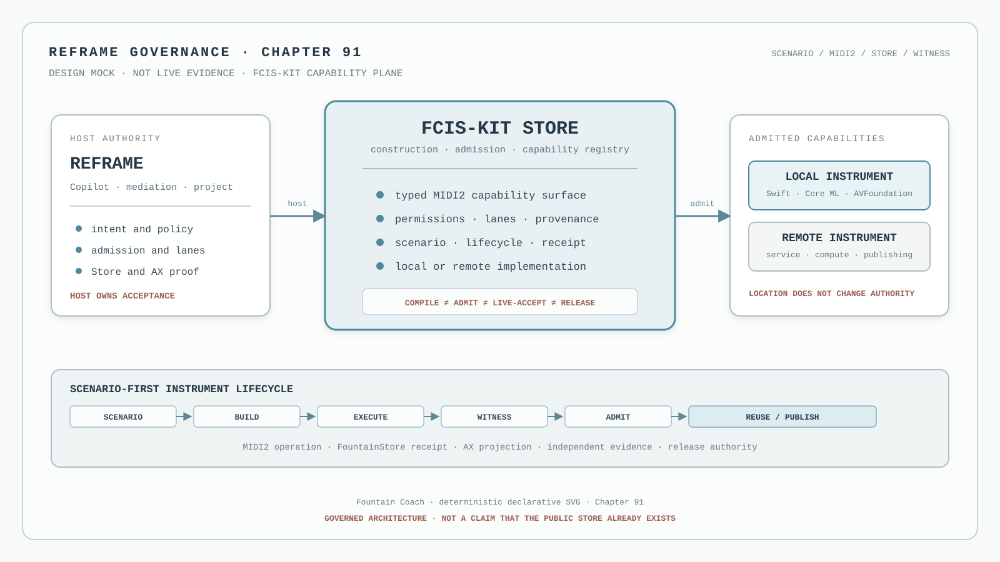

# 91 — The FCIS-KIT Instrument Store Is the Capability Plane

The FCIS-KIT Instrument Store is Fountain Coach's governed distribution model for software capabilities that present
themselves as MIDI2 instruments. It is not a second application store, a plugin folder, or a claim that every proposed
instrument already exists. This chapter governs the architecture and the boundary between a capability's claim and the
evidence required to admit it.



*Design mock, not live evidence. The illustration is a deterministic architectural projection and contains no Store
identifier, MIDI2 correlation, provider receipt, instrument result, or release claim.*

## The decision

Fountain Coach treats the instrument as the unit of governed capability distribution:

```text
scenario → implementation → build → execution → evidence → admission → reuse
```

Reframe is the primary host and development environment. FCIS-KIT defines the construction boundary. MIDI2 provides
the operational language. Scenarios define expected behaviour. FountainStore records durable lifecycle and receipt
evidence. Independent witnesses determine which claims may be promoted.

No layer silently replaces another:

- the MIDI2 IDL defines the operation and lifecycle contract;
- FCIS-KIT defines the reusable instrument package boundary;
- Reframe mediates intention, permissions, project state, and host authority;
- the instrument owns its declared execution and reports its lifecycle;
- FountainStore proves durable effects and receipts;
- AX proves the user-facing surface;
- independent scenario and security witnesses establish acceptance; and
- release authority promotes a named build.

## Instrument, not application

A conventional application store distributes complete applications. The FCIS-KIT Instrument Store distributes
admitted capabilities. The implementation may be a local Swift wrapper, an Apple-native framework, a model, a DSP
engine, a hardware bridge, a remote Linux service, or a publishing backend. Its implementation language and physical
location remain behind the boundary.

The instrument is legitimate only when it declares enough machine-readable and human-readable information for the host
to reason about:

- capability identity and supported MIDI2 operations;
- permissions, data access, and external resources;
- local, remote, or composed execution;
- lifecycle, progress, cancellation, recovery, and terminal receipts;
- timing, latency, jitter, deadline, and resource claims where relevant;
- scenario coverage and evidence lineage;
- FCIS-KIT contract version, implementation provenance, and build identity; and
- admission state and the authority that established it.

This list is an instrument admission contract, not a census of instruments. The current instrument registry remains an
implementation authority and must be queried rather than copied into this chapter.

## Reframe remains the host authority

Reframe is not merely a client of the Store. It is the environment in which capabilities become useful. The writer,
developer, composer, or operator enters through Reframe and its Copilot. A reasoning worker may select and compose
admitted instruments, but neither the model nor an individual instrument owns product authority.

Reframe remains responsible for:

- mediating intention before execution;
- resolving capability identity and admission;
- applying permissions, lane, cost, privacy, and consent policy;
- binding work to a project and FountainStore;
- exposing state through MIDI2 Monitor and AX; and
- deciding whether the resulting evidence supports live acceptance or release.

An installed instrument is therefore an admitted participant in a governed runtime, not an unrestricted extension of
the application.

## Scenario-first creation

The primary authoring unit is the scenario. A maintainer may describe a missing capability in natural language, but
the resulting meaning must be formalized as a versioned, executable prompt-contract before implementation begins. The
scenario names the target capability, preconditions, permitted resources, expected lifecycle, terminal predicates, and
evidence required for admission.

If the capability does not exist, restricted FCIS-KIT creation mode may produce a candidate. The stable Reframe host
remains authoritative while the candidate is built in an isolated worktree or environment, launched as a separate
process, exercised through MIDI2, and observed by independent witnesses. Codex may inspect, patch, build, test, and
execute the candidate within that declared scope. Codex is the implementation worker, not the arbiter of success.

Restricted creation mode MUST NOT grant production credentials, release signing, stable-binary replacement, arbitrary
repository mutation, or authority to convert its own output into an admission decision. Promotion is a separate
governed act.

## Lifecycle and trust states

An instrument does not become public merely because it compiles or responds once. The host distinguishes at least:

```text
private instrument → organization instrument → published instrument
```

Those distribution states are projections over the operational states already governed by the product:

```text
exists → available → executable → locally tested → live-accepted → released
```

Discovery is not admission. Admission is not live acceptance. Live acceptance is not release. Each transition names its
own authority and evidence. A public registry may contain a versioned, signed, scenario-proven instrument only after
the relevant acceptance and release authorities have completed their work.

## One capability plane across machines

An instrument may reside on the same Mac as Reframe or on a remote host. A local Core ML, Vision, Speech, Metal,
AVFoundation, CoreMIDI, or VideoToolbox wrapper and a remote publication, DNS, artifact, or computation service can
participate in the same conceptual plane.

The deployment topology is secondary to the declared capability contract. The boundary must still expose where data
goes, which lane is used, what it costs, what timing it can guarantee, how failures are reported, and which authority
holds the credentials. Remote execution does not become local merely because it is represented as a MIDI2 instrument.

## Timing is part of the contract where it matters

MIDI2 can carry more than an operation name. Where a capability claims time-sensitive behaviour, its contract and
receipts may include scheduled execution, timestamps, latency, jitter, missed deadlines, clock drift, and buffer state.
Slow reasoning may prepare work remotely while time-critical execution happens at the instrument edge.

Timing claims remain claims until the relevant telemetry and independent evidence establish them. MIDI2 instrumentation
improves observability; it does not by itself prove timing quality.

## Reasoning workers do not become the platform

Codex is one possible reasoning participant. It may interpret a goal, inspect admitted capabilities, compose a job,
observe outcomes, recover from failure, and escalate when human approval is required. The instruments remain
independently defined and usable.

Routing may consider local versus remote execution, privacy, cost, energy, latency, quality, licensing, and
availability. These are runtime facts and governed policy inputs—not hidden plugin preferences and not promises that a
particular provider will always be selected.

## Commercial and public boundary

An admitted instrument may be free, paid, subscription-based, locally licensed, usage-priced, or backed by an external
provider. Commercial terms and data movement must be visible before execution and attributable to actual instrument
activity where accounting is claimed.

The public projection may publish the contract, sanitized capability identity, admission state, release references,
and evidence links. It MUST NOT publish private source, credentials, Store data, prompts, manuscript material,
unreleased findings, or private runtime claims. Making an implementation public is a separate repository-visibility,
license, dependency, secret-scan, fixture-scrub, and maintainer decision.

## What this milestone establishes

This chapter establishes Fountain Coach's governed architectural direction: capabilities can be built, admitted,
composed, and distributed as observable MIDI2 instruments under Reframe's host authority.

It does not establish that:

- a public FCIS-KIT marketplace is deployed;
- every proposed local or remote instrument exists;
- a candidate is executable, live-accepted, or released;
- a third-party service has been admitted;
- commercial accounting is complete; or
- a public instrument claim is supported without its named evidence.

## Stop conditions

Stop rather than build, admit, or publish when:

- the MIDI2 IDL, instrument identity, or admission authority is missing;
- the scenario lacks terminal predicates or evidence requirements;
- the candidate would run against production authority or credentials without an explicit grant;
- the stable host, candidate process, Store path, or provenance tuple cannot be bound;
- lifecycle events, cancellation, failure, or terminal receipt are not observable;
- an instrument's data movement, lane, cost, permission, or timing claim is undeclared;
- a model or Codex response is being treated as an admission or release decision;
- independent AX, Store, scenario, security, or timing evidence required by the claim is unavailable; or
- a public projection would expose private implementation, credentials, prompts, manuscript material, or Store data.

## Governing sentence

The FCIS-KIT Instrument Store distributes governed capabilities, not opaque applications: Reframe owns mediation and
acceptance, MIDI2 exposes the operational contract, scenarios define what must happen, FountainStore and independent
witnesses establish what did happen, and only the owning release authority may promote an instrument for reuse.
[Chapter 103](103-fcis-kit-semantic-factory-and-wired-instrument-event-stream.md) applies this capability-plane rule
to a composed Semantic Factory and its monitored event stream. [Chapter 108](108-reframe-is-a-swift-native-cross-platform-runtime.md)
extends the same plane across portable Reframe runtime products and platform hosts.
