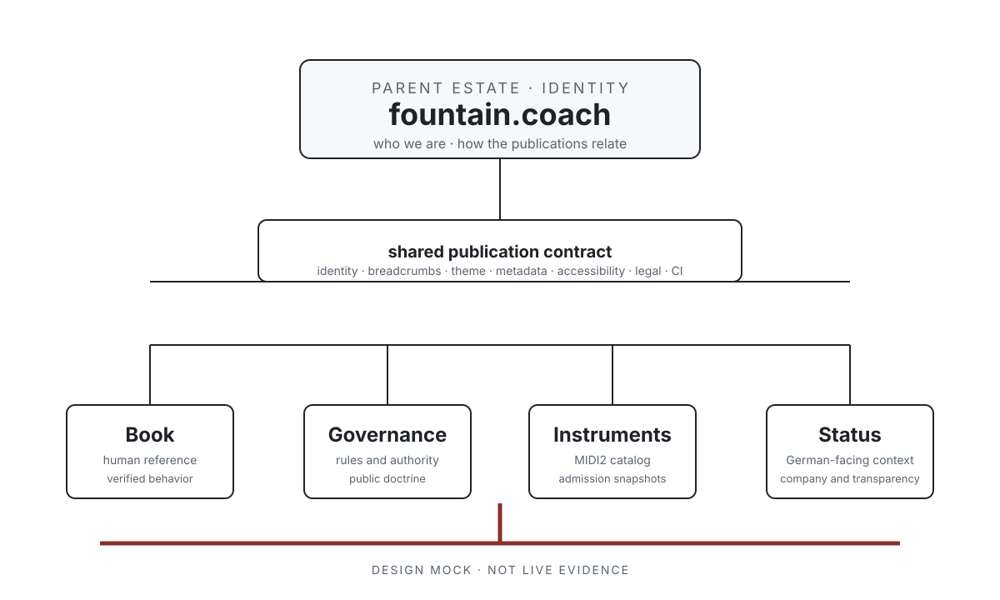

# 92 — Fountain Coach Publication Estate: Semantic Domain and CI Governance

The Fountain Coach web estate is one public identity expressed through specialized publication domains. The top-level
domain explains the identity and lineage. Each subdomain owns one authoritative question. Shared presentation and CI
make those relationships legible without erasing the needs of the individual publication.



*Design mock, not live evidence. This illustration defines the intended semantic relationship; it does not claim that
every shared template, CI gate, or cross-domain integration is already implemented.*

## The decision

Fountain Coach governs its public sites as one publication estate:

```text
fountain.coach
  ├── book.fountain.coach        human reference
  ├── governance.fountain.coach  rules and authority
  ├── instruments.fountain.coach MIDI2 instrument catalog
  └── status.fountain.coach      German-facing company and transparency context
```

The parent domain establishes identity, founder context, lineage, and the map of authorities. A subdomain may have a
distinct audience, language, visual emphasis, or evidence model, but it must declare its role and remain connected to
the estate's shared semantic contract.

## Domain roles

| Domain | Authority it owns | It must not impersonate |
| --- | --- | --- |
| `fountain.coach` | Fountain Coach identity, lineage, founder story, and publication map | a runtime, legal register, or capability proof source |
| `book.fountain.coach` | human-readable Reframe behavior, scenarios, release boundaries, and evidence links | the private runtime or governance authority |
| `governance.fountain.coach` | reviewed rules, architectural doctrine, and public/private boundaries | live runtime state or a named-build release authority |
| `instruments.fountain.coach` | MIDI2 instrument descriptions, verification snapshots, and admission context | unrestricted application-store claims or live acceptance without evidence |
| `status.fountain.coach` | German-facing company, transparency, operational, and legal context | the technical Book or the governance source of architectural truth |

## Shared publication contract

Every site MUST implement or explicitly inherit the following traits:

1. **Identity:** Fountain Coach identity, founder/brand relationship, and the site's declared publication role.
2. **Header:** logo, role label, estate navigation, theme control, and a stable route to the parent domain.
3. **Breadcrumbs:** a semantic path from Fountain Coach to publication role, section, and current page.
4. **Footer:** sibling publications, legal notices, privacy, accessibility, copyright, compliance, source/provenance,
   and the appropriate founder/company boundary.
5. **Typography and spacing:** shared readable text scale, line length, focus treatment, responsive spacing, and
   semantic use of display, body, and metadata styles.
6. **Theme:** light and dark palettes selected from system preference with an accessible persistent user override.
7. **Social metadata:** canonical URL, concise title, complete description, stable illustration, dimensions, alt text,
   and a share destination that is the semantic page rather than an image-only route.
8. **Publication state:** explicit status such as draft, reviewed, or published; a local preview must never be described
   as the public publication.
9. **Claim boundary:** the page identifies what its authority establishes and what remains owned by another domain or
   by private runtime evidence.
10. **Accessibility:** semantic landmarks, skip navigation, heading order, keyboard operation, visible focus, named
    controls, adequate contrast, and mobile hit targets.

Shared traits are a contract, not a requirement that every site look identical. A domain may change its content model,
language, navigation depth, illustration treatment, or density when that variation follows its declared role.

## Cross-domain semantics

The shared header and footer form a publication graph. Links are meaningful edges:

- the TLD links down to each authority;
- each subdomain links up to the TLD and sideways to the authorities it depends on;
- the Book links to Governance for rules and to Instruments for capability context;
- Instruments links to the Book for human interpretation and to Governance for admission boundaries;
- Status links to the public legal and company context without becoming the technical authority; and
- Governance links to the Book and named public projections without treating those projections as governance.

No page may use a sibling link as evidence that the sibling has accepted or released the claim being described.

## CI contract

The publication pipeline MUST validate the estate as a graph, not as isolated static sites. Every publication build
must run:

- template contract checks for header, breadcrumbs, footer, role metadata, theme control, and publication state;
- canonical, Open Graph, Twitter/X, image dimension, and alt-text checks;
- internal route, asset, and cross-domain link checks;
- light/dark accessibility and keyboard checks;
- desktop, mobile, menu-open, and reduced-motion visual checks where the site's role requires them;
- private-source, credential, stale-preview, and unsafe-claim scans;
- provenance checks binding generated content to its source repository and reviewed state; and
- deployment checks for the exact host, dedicated root, HTTPS response, and rollback record.

CI must allow a domain-specific exception only when the exception is declared in the domain manifest, names the reason,
and preserves the semantic invariant it cannot omit. A visual difference is not an exception; a missing identity,
claim boundary, legal route, or accessibility surface is a contract failure.

## Authority and release boundary

The template and CI contract govern publication shape. They do not promote content into runtime truth. The authority
chain remains:

```text
private runtime and live state → current behavior
checked registry and contracts  → identity and policy
acceptance evidence            → what has been proven
named release manifest          → what has shipped
public publications             → what readers can inspect
```

This chapter therefore governs the connective tissue of the estate. It does not replace the Book's evidence rules, the
instrument admission contract, the status site's legal declarations, or the governance source itself.

## Rules

1. Every public Fountain Coach domain MUST declare one publication role and one claim boundary.
2. Every public domain MUST expose the shared identity, navigation, breadcrumb, footer, theme, accessibility, metadata,
   provenance, and publication-state contract, either directly or through a reviewed template implementation.
3. A subdomain MAY specialize its visual and content design only when the variation serves its declared authority and
   keeps the shared semantic edges intact.
4. CI MUST validate the publication graph and the exact deployment tuple; a green site-local build is not sufficient.
5. A domain-specific exception MUST be explicit, reviewable, and non-destructive to identity, legal, accessibility,
   claim-boundary, and provenance invariants.
6. Social cards and illustrations are publication projections. They MUST NOT imply live evidence, release, admission,
   or legal status that their owning authority has not established.
7. The generated public site is never allowed to expose private runtime source, Store data, credentials, or deployment
   secrets.

## Governing sentence

Fountain Coach publishes one semantically connected estate: the TLD names the identity, each subdomain owns a distinct
question, and shared templates and CI make those boundaries visible without flattening their authority.
